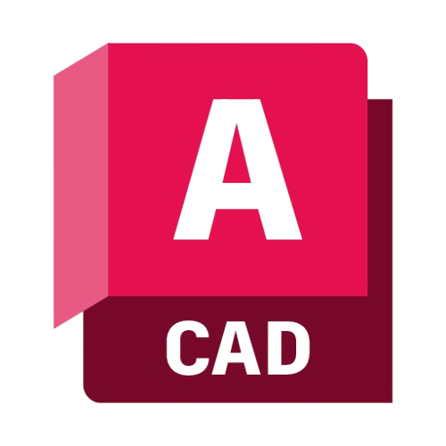
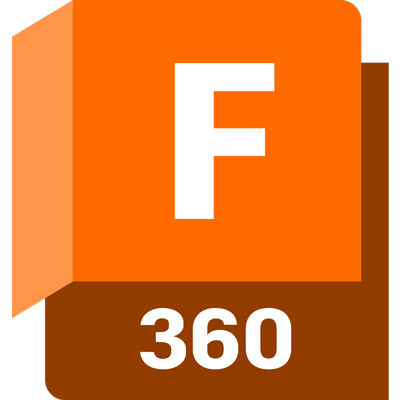

<header>
  <h1 align="center">Hey 👋, I'm Logan Gillett</h1>
<h3 align="center">Thanks for stopping by my Github!</h3>
  
I am a first-year Computer Engineering student at the University of Waterloo in Ontario, Canada, and am experienced in a number of programming languages as well as have worked on multiple embedded projects. I aspire to create meaningful things that help others! If you want to learn more about me or just generally reach out, send me an email or check out my personal website, I'd be happy to chat!

  
 
    &nbsp;
       
    &nbsp;&nbsp;
    
  

</header>
<main>
  

  <h3>🔭 About Me:</h3>
  
&nbsp;
    🔹 I have 3+ years of experience in <strong>C-Based Languages</strong>.   &nbsp;
    🔹 I also have 3+ years working with <strong>embedded</strong> systems.   &nbsp;
    🔹 I'm enjoy working with web developement, with 6+ months of <strong>web-dev</strong> experience using <strong>Javscript</strong> and <strong>React</strong>.   &nbsp;
    🔹 I'm working on a website for UWaterloo students <strong>(releasing soon)</strong> using <strong>Next.js</strong>.   
  
Outside of programming, I also enjoy spending quality time with friends and family, playing music, reading books and rock wall climbing. If you're in the Waterloo region and want to meet up, also feel free to message me!

  

      

  

      <h3 align="left">🛠️ Languages and Tools:</h3>
      
 
       
       
       
       
      
       
       
      
       
        
       
       
        
       
      
      
      
      
        
      
      
      
       
      
      
      
       

  

</main>
<footer>
    <!-- statsforgit.com stuff -->
  

    <!--  -->
    <!--  -->
    <!--  -->
  

</footer>
